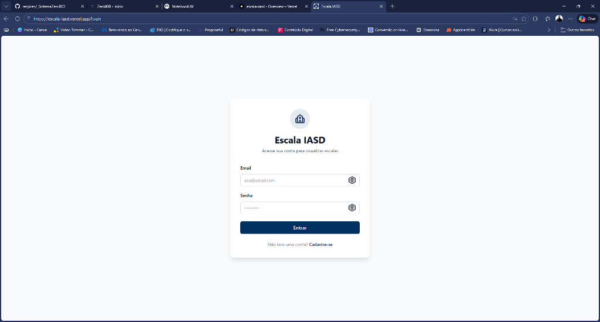
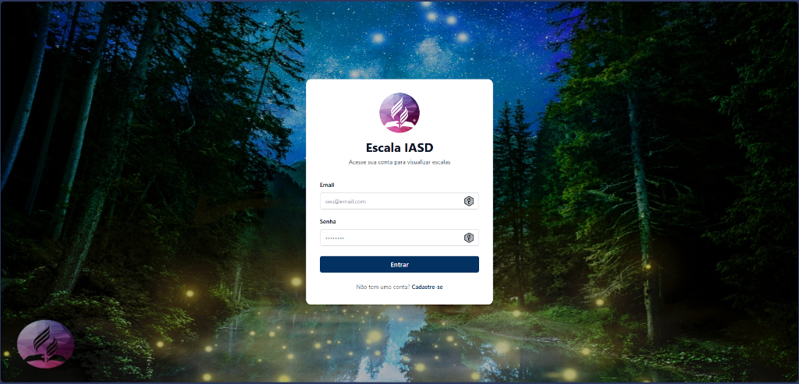

# Sistema de Escala IASD





## Sobre o Projeto

O **Sistema de Escala IASD** é uma aplicação Web Progressiva (PWA) desenvolvida para facilitar a gestão de escalas dos ministérios da Igreja Adventista do Sétimo Dia. O sistema permite que membros marquem sua disponibilidade e que líderes organizem as escalas de forma visual e eficiente, com regras personalizadas por departamento.

## Funcionalidades Principais

### Geral
- **Versículo Diário**: Uma nova inspiração bíblica a cada acesso.
- **PWA (Progressive Web App)**: Instale o app no celular ou desktop e use como um aplicativo nativo.

### Para Membros
- **Marcação de Disponibilidade**: Calendário interativo para selecionar os dias livres no mês.
- **Visualização de Escalas**: Acesso rápido às datas em que foi escalado.
- **Painel Pessoal**: Visualização clara de status e próximos compromissos.

### Para Líderes
- **Gestão de Equipes**: Controle total sobre os membros de cada ministério (Música, Sonoplastia, Diáconos, etc.).
- **Edição de Membros**: Atualize informações e funções dos integrantes da equipe.
- **Criação de Escalas Inteligente**: Interface intuitiva com validação de regras específicas (ex: limite de integrantes por culto).
- **Personalização**: Opção de adicionar capa personalizada para o ministério.

## Tecnologias Utilizadas

- **Frontend**: React 19, TypeScript
- **Backend / Banco de Dados**: Supabase
- **Build Tool**: Vite
- **Estilização**: Tailwind CSS 3
- **Roteamento**: React Router Dom
- **Ícones**: Lucide React
- **PWA**: Vite Plugin PWA
- **Gerenciamento de Estado**: React Context API
- **Datas**: Date-fns

## Como Rodar o Projeto

1. Clone o repositório:
```bash
git clone https://github.com/seu-usuario/escalaiasd.git
```

2. Instale as dependências:
```bash
npm install
```

3. Configuração de Variáveis de Ambiente:
Crie um arquivo `.env` na raiz do projeto com as credenciais do Supabase:
```env
VITE_SUPABASE_URL=sua_url_do_supabase
VITE_SUPABASE_ANON_KEY=sua_chave_anonima_do_supabase
```

4. Execute o servidor de desenvolvimento:
```bash
npm run dev
```

5. Acesse no navegador:
`http://localhost:5173`

## Deploy

O projeto está configurado para deploy na Vercel e utiliza Supabase como backend.

## Licença

Este projeto é de uso interno para gestão de ministérios.
